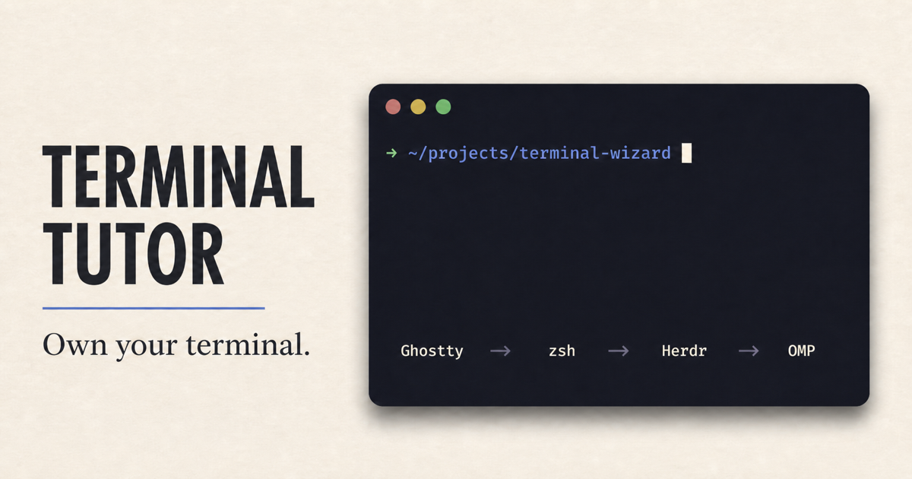

# Benjamin's dotfiles

A small, deliberate macOS development environment:

```text
Ghostty → zsh + Starship → Herdr → OMP / Codex
                    └── mise → Node, pnpm, Bun, Go, Python
```

The repository is the source of truth for shell behavior, applications,
runtimes, safety defaults, and the tool manifest consumed by Terminal Tutor.
Network work never happens during shell startup.

## Install on a Mac

Install Apple's Command Line Tools and Homebrew first. Then clone to a stable
location and inspect the plan:

```bash
git clone https://github.com/benjaminsehl/dotfiles ~/Sites/dotfiles
cd ~/Sites/dotfiles
./apply --dry-run
./apply
```

Existing target files are moved into a timestamped
`~/.config/dotfiles-backups` directory before any symlink is created. Running
`apply` again is a no-op.

Afterward:

```bash
gh auth login
dev-doctor
```

Open OMP and use `/login` followed by `/model`. In Ghostty's application menu,
choose **Set Ghostty as Default Terminal App**.

## Daily commands

- `apply` is the single reconciliation entry point for packages, links, runtimes, and integrations.
- `apply --dry-run` previews changes, `apply --check` verifies the setup, and `apply --update` intentionally advances declared tools.
- `dev-doctor` checks Brewfile drift, symlinks, runtimes, Ghostty, Herdr, OMP/Codex safety and integrations, authentication, and sensitive file modes.
- `configure-codex` safely applies Codex's on-request, auto-reviewed approval defaults without replacing the rest of its machine-local configuration.
- `terminal-wizard` builds and starts the production-local interactive course; `terminal-wizard --dev` enables hot reload, and `terminal-wizard --check` runs its complete release gate.
- `dev-update` updates the declared Homebrew set, refreshes exact mise pins, and synchronizes the teaching manifest from live command versions. Declaration changes make the repository dirty on purpose so they can be reviewed and committed.
- `scripts/test` runs static checks, a secret scan, and a two-pass bootstrap test in an isolated temporary home.

See [docs/WORKFLOW.md](docs/WORKFLOW.md) for the fast shell vocabulary and the
manifest-backed learning path.

Codex and OMP have intentionally separate safety defaults. See
[docs/CODEX.md](docs/CODEX.md) for the exact behavior.

## Terminal Tutor



The repository includes a local, interactive course backed by wterm and the
same `manifest/setup.json` that declares the workstation. Practice runs in an
in-memory shell; an optional read-only folder snapshot exposes selected project
text below `/workspace`; Live Mac requires typed consent before opening a real
loopback-only zsh PTY.

```bash
terminal-wizard
```

Then open <http://127.0.0.1:4317>. See
[apps/terminal-wizard/README.md](apps/terminal-wizard/README.md) for the trust
boundaries and full verification command.

## Private customization

`~/.zshrc.local` and `~/.gitconfig.local` are created locally and never
tracked. Sohne Mono is also user-owned and is not redistributed;
JetBrainsMono Nerd Font Mono is the reproducible fallback.

See [docs/SECURITY.md](docs/SECURITY.md) before adding another configuration
file.

## Provenance

The explicit PATH, `apply` reconciliation model, pinned mise workflow,
seven-day release gate, conditional tool ergonomics, fzf previews, and local
override approach are adapted from
[Tobi Lütke's dotfiles at the audited revision](https://github.com/tobi/dotfiles/tree/c1a2d9fc0d6248bd6549c99c387b8c6dcc984c3a). The implementation is
Mac-specific, secret-safe, does not pull automatically, and avoids first-run
network surprises in zsh.

## License

MIT
